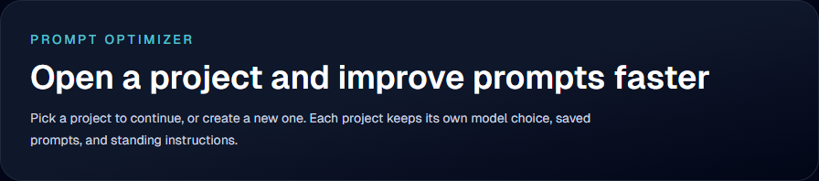
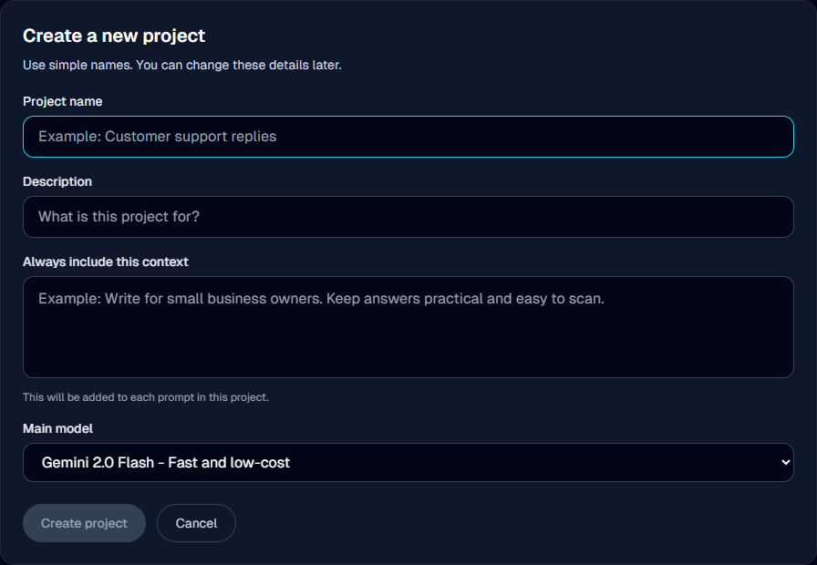
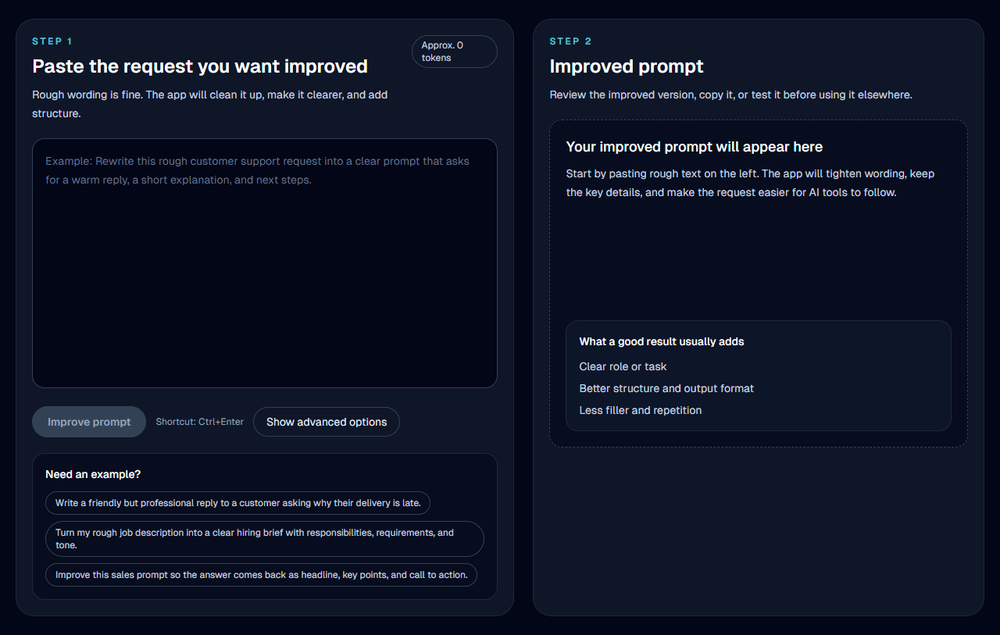

# Prompt Optimizer

A local app that turns rough ideas into clearer, better-structured prompts, organized by project with saved history.

## License

This repository is public for viewing, learning, and non-commercial improvement.

Commercial use is not allowed without prior written permission from the repository owner.

See [LICENSE](./LICENSE).

For commercial licensing requests, contact:

`brw.sudheer@gmail.com`

## Public Repo Notes

- Do not commit `backend/.env`
- Do not commit `backend/prompts.db`
- Do not commit caches or build folders such as `frontend/.next`, `frontend/node_modules`, or `backend/.kb_embeddings.pkl`
- Each contributor should use their own API keys

## Prerequisites

- Python 3.11 or newer recommended
- Node.js 18 or newer recommended
- npm installed
- Windows, macOS, or Linux with terminal access

## Screenshots

Home screen:



Create project form:



Main editor:



## Quick Start

1. Copy `backend/.env.example` to `backend/.env`
2. Add your own API keys to `backend/.env`
3. Start the app with `Prompt_Optimizer.vbs` or `Prompt_Optimizer.bat`
4. Open `http://localhost:3001`

## Environment File

Create this file before running the backend:

```bash
backend/.env
```

Start from this template:

```bash
ANTHROPIC_API_KEY=your_anthropic_key_here
OPENAI_API_KEY=your_openai_key_here
GEMINI_API_KEY=your_gemini_key_here
GROQ_API_KEY=your_groq_key_here
DATABASE_URL=sqlite:///./prompts.db
DEFAULT_MODEL=gemini-2.0-flash
OPTIMIZER_MODEL=gemini-2.0-flash
TOKEN_WARN_THRESHOLD=0.6
TOKEN_SUMMARIZE_THRESHOLD=0.75
TOKEN_HARD_LIMIT=0.90
```

## Where to Get API Keys

- OpenAI: `https://platform.openai.com/api-keys`
- Anthropic: `https://platform.claude.com/settings/keys`
- Google Gemini: `https://aistudio.google.com/app/apikey`
- Groq: `https://console.groq.com/keys`

## Features

- Project-based prompt organization
- Prompt cleanup and restructuring
- Multi-provider AI support
- Local history and template reuse
- Token tracking and context management

## Known Issues

- AI response speed depends on the selected provider and network quality
- Missing API keys can cause provider fallback errors
- First-time local setup may take longer because dependencies need to be installed

## Setup

### Backend

```bash
cd backend
pip install -r requirements.txt
python -m uvicorn main:app --port 8000 --reload
```

### Frontend

```bash
cd frontend
npm install
npm run dev -- -p 3001
```

## Launchers

- `Prompt_Optimizer.vbs` starts the app quietly
- `Prompt_Optimizer.bat` points to the quiet launcher
- `start.ps1` starts backend and frontend together

## Architecture

```text
backend/                 FastAPI + SQLite
  routers/               API routes
  services/              optimization and provider logic

frontend/                Next.js + Tailwind
  app/                   app routes
  components/            UI components
  lib/                   API and store logic
```

## Local Data

SQLite data is stored locally in:

```text
backend/prompts.db
```

Keep that file out of public commits unless you intentionally want to share local history data.

## Project Docs

- [CONTRIBUTING.md](./CONTRIBUTING.md)
- [SECURITY.md](./SECURITY.md)
- [ROADMAP.md](./ROADMAP.md)
- [CHANGELOG.md](./CHANGELOG.md)
